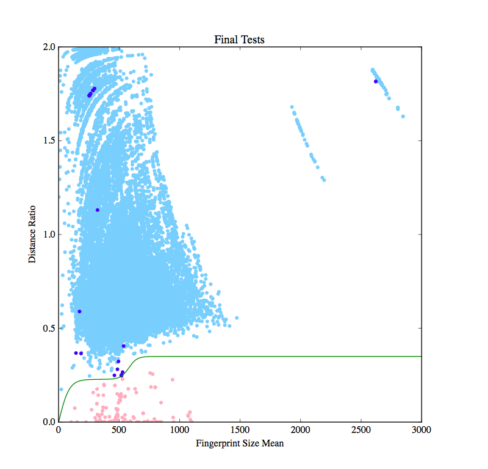

# code-plagiarism-detector
My solution for VK Cup 2015 [Wild Card Round 2](http://codeforces.ru/contest/537/standings).

Ranked 11th out of 120 solutions. It turned out the solution would have performed better without the [heuristic](https://github.com/slava-sh/code-plagiarism-detector/commit/741d166e2b024e44db9f5274a45a37ea50d4ac74) that I added in the last moment.

